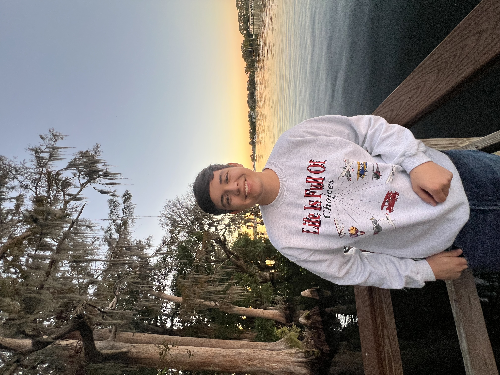

# Caio Folger

<!DOCTYPE html>
<html lang="en">
<head>
<title>Caio Folger</title>
<meta charset="utf-8">
<meta name="viewport" content="width=device-width, initial-scale=1">

</head>

<h2>Biography</h2>

    
    My name is Caio Folger and I was born and raised in Florida. I began my IT and cybersecurity journey with a simple curiosity in high school, but that curiosity was quickly replaced by passion as I began my undergraduate degree at the University of Central Florida. I majored in information technology with a SCAN(Secure Computing and Networks) minor, and while the coursework has been difficult, I have achieved a solid GPA. This has combined with my work as a data science research assistant, which was a remote position that taught me cornerstones of machine learning and AI models. 
     
    I am most interested in pursuing cybersecurity roles but any job in the IT field appeals to me as my biggest goal is to learn more about the systems and technology that will define humanity's future.

<h2>Education</h2>

I graduated from the University of Central Florida

<ul>
  <li>Major: Information Technology</li>
  <li>Minor: Secure Computing and Networks</li>
  <li>GPA: 3.7</li>
  <li>2022 - 2026</li>
</ul>
<h3>Achievements in Education</h3>
<ul>
  <li>Covered the fundamentals of code structures and techniques through the language of C</li>
  <li>Performed highly in courses using Java, Python, HTML, C and MySQL</li>
  <li>Scored highly (A or B+) in infamously difficult courses such as Computer Science 1, Object Oriented Programming and Physics 2.</li>
  <li>Mastered cybersecurity concepts through my SCAN minor</li>
</ul>

<h2>Projects</h2>
<!-- Links to Project pages -->
<ul>
  <li><a href="Machine_Learning_Model.html">Machine learning model based off solar panel experiments</a></li>
  <li><a href="Java_Project.html">Faculty and Student Management Program for Object Oriented Programming Course</a></li>
</ul>

<h2>Skills and Certifications</h2>
<!--  List of Relevant Skills -->
<ul>
  <li>Customer service and interpersonal communications</li>
  <li>Adaptability and quick learning</li>
  <li>Organization skills</li>
  <li>Problem-solving for general and technical issues</li>
  <li>Computer literacy</li>
  <li>Teamwork</li>
  <li>Efficient in Word and Excel</li>
</ul>

<h2>Previous Job Experience</h2>
<ul>
  <li>Customer service and interpersonal communications</li>
  <li>Adaptability and quick learning</li>
  <li></li>
</ul>

</body>
</html>